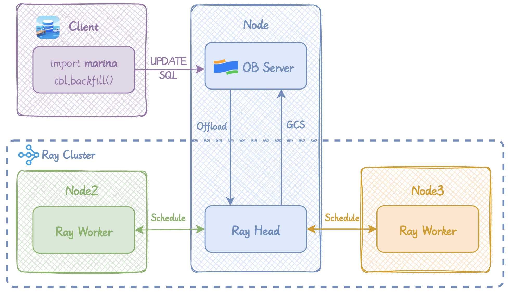

# Marina

<div align="center">
  
</div>

## ✨ Overview

Marina is an enhanced version of PySeekDB that supports scalable feature engineering using Python UDFs, in a style similar to [LanceDB Geneva](https://lancedb.com/blog/geneva-feature-engineering/). It helps you easily harness feature engineering using Python UDFs ——— to add them as generated columns, and backfill them asynchronously. You can use either built-in Python functions, or open-source models (e.g. [BLIP](https://huggingface.co/Salesforce/blip-image-captioning-base/tree/main), [ViT](https://huggingface.co/laion/CLIP-ViT-B-32-laion2B-s34B-b79K/tree/main)) to enrich dataset features.

Marina is designed to work with the OceanBase distributed workflow orchestration system.
It integrates with Ray, leveraging its powerful capabilities for UDF offloading computation, elastic resource scaling, low-latency task scheduling, and automatic fault recovery.


## 🚀 Architecture



## 📖 Demonstration

### Step 1: Connect to the database

Open a session with `db.connect` using an OceanBase-compatible MySQL URI.

```python
from pyseekdb.client import db

conn = db.connect("mysql://root:@127.0.0.1:2881/test?tenant=mysql")
```

### Step 2: Create a table

Declare a PyArrow schema and load rows from a list of dicts. Sample images can be downloaded from the [Oxford-IIIT Pet Dataset](https://www.robots.ox.ac.uk/~vgg/data/pets/).

```python
import pyarrow as pa

schema = pa.schema([
    pa.field("image_oss_url", pa.string()),
    pa.field("filename", pa.string()),])

data = [
    {"image_oss_url": "url1", "filename": "Birman.jpg"},
    {"image_oss_url": "url2", "filename": "Havanese.jpg"},
    {"image_oss_url": "url3", "filename": "Persian.jpg"},]

tbl = conn.create_table(name="pets", data=data, schema=schema)
```

### Step 3: Define a Python UDF

The UDF takes an array of OSS URLs, fetches images, applies the pretrained BLIP-Caption model to the batch, and returns an array of descriptive captions.

```python
import io
import numpy as np
import torch
from PIL import Image
from transformers import BlipProcessor, BlipForConditionalGeneration


def generate_caption_udf_batch(url: np.ndarray) -> np.ndarray:
    images = load_images_from_oss_urls(url)
    processor = BlipProcessor.from_pretrained("Salesforce/blip-image-captioning-base")
    model = BlipForConditionalGeneration.from_pretrained("Salesforce/blip-image-captioning-base")

    device = torch.device("cuda" if torch.cuda.is_available() else "cpu")
    model.to(device)
    model.eval()
    n = len(images)
    out = np.empty(n, dtype=np.object_)
    pil_images = [Image.open(io.BytesIO(b)).convert("RGB") for b in images]

    with torch.no_grad():
        inputs = processor(pil_images, return_tensors="pt")
        inputs = {k: v.to(device) for k, v in inputs.items()}
        gen = model.generate(**inputs, max_length=50)
        captions = processor.batch_decode(gen, skip_special_tokens=True)

    for i, cap in enumerate(captions):
        out[i] = cap
    return out
```

### Step 4: Add the UDF as a generated column

`add_column` stores the Python UDF as routine, and sets routine_id in column meta.

```python
tbl.add_column(
    col_name="caption",
    data_type=pa.string(),
    udf=generate_caption_udf_batch,
    udf_name="generate_caption_udf",
    input_columns=["image_oss_url"],
)
```

### Step 5: Backfill the generated column

`backfill` materializes the column by evaluating UDF on the Ray cluster.

```python
tbl.backfill(
    col_name="caption",
    num_gpus=2,
    num_batches=4,
)
```

For a complete runnable example, refer to `test_udf/test_geneva_compatibility.py`.

## 💡 Requirements

**[Ray.](https://github.com/Haustle-v/ray/tree/ob-as-gcs)** The OceanBase-compatible fork, using OceanBase as Ray's Global Control Service (GCS) for better fault tolerance.

**[OceanBase.](https://github.com/oceanbase/oceanbase)** The storage engine, enterprise edition.
